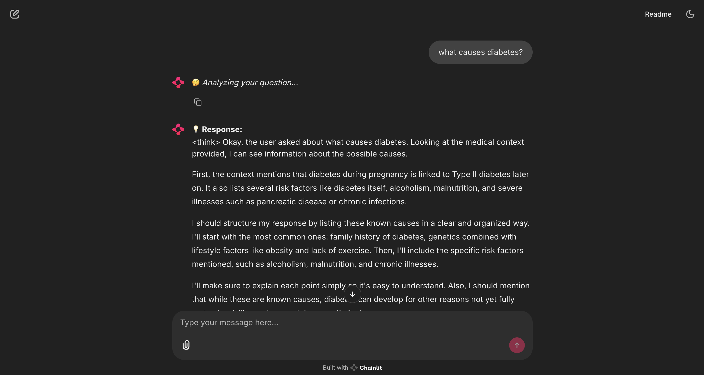

# 🏥 AI-Powered Medical Chatbot

An AI-driven medical chatbot that provides health-related assistance using advanced NLP and machine learning techniques. This chatbot leverages a **RAG-based approach** to enhance diagnostic accuracy by retrieving information from **medical PDFs** and integrating it with the **DeepSeek-R1-Distill-Qwen-7B** LLM.

---

## 📌 Features

- **Medical Diagnosis**: Answers health-related queries and provides preventive measures.
- **Context-Aware Responses**: Uses **RAG-based retrieval** from **medical books** for better accuracy.
- **Voice Support**: Includes **voice-to-text** and **text-to-voice** functionality.
- **Chainlit UI**: Interactive chatbot interface for seamless user experience.
- **Error Handling**: Graceful fallback messages in case of issues.

---

## 🛠️ Tech Stack

- **LLM**: DeepSeek-R1-Distill-Qwen-7B (via Ollama)
- **Data Processing**: PDF text extraction 
- **Frameworks & Libraries**:
  - Python
  - Chainlit (for UI)
  - Ollama (LLM hosting)
  - PyMuPDF (PDF processing)
  - FAISS (for embedding storage)

---

## 📂 Project Structure

```
📦 medical-chatbot
 ┣ 📂 medical_pdfs             # Folder containing medical PDFs
 ┣ 📜 medical_chatbot.py       # Core chatbot logic
 ┣ 📜 ui_chatbot.py           # Chainlit UI integration
 ┣ 📜 requirements.txt        # Required Python dependencies
 ┣ 📜 README.md               # Project documentation
```

---

## 🚀 Installation & Setup

### 1️⃣ Clone the Repository
```bash
git clone https://github.com/your-username/medical-chatbot.git
cd medical-chatbot
```

### 2️⃣ Install Dependencies
```bash
pip install -r requirements.txt
```

### 3️⃣ Set Up Ollama for DeepSeek Model
Ensure **Ollama** is installed and running:
```bash
ollama pull deepseek-r1:latest
```

### 4️⃣ Process Medical PDFs
Extract text from the medical PDFs:
```bash
python pdf_processor.py
```

### 5️⃣ Run the Chatbot
```bash
python ui_chatbot.py
```

---

## 📸 Screenshots
_Add Chainlit UI screenshots here_

### **1️⃣ Chatbot UI**



---

## 📌 Future Enhancements
- Integrate **NER and intent detection**.
- Improve response accuracy with **better medical data sources**.
- Deploy as a **web or mobile application**.

---

## 🏆 Contributing
Contributions are welcome! Feel free to submit **issues** and **pull requests**.

---


